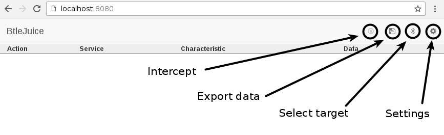
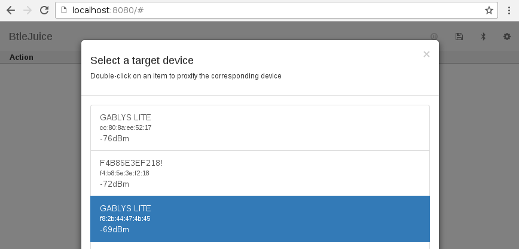
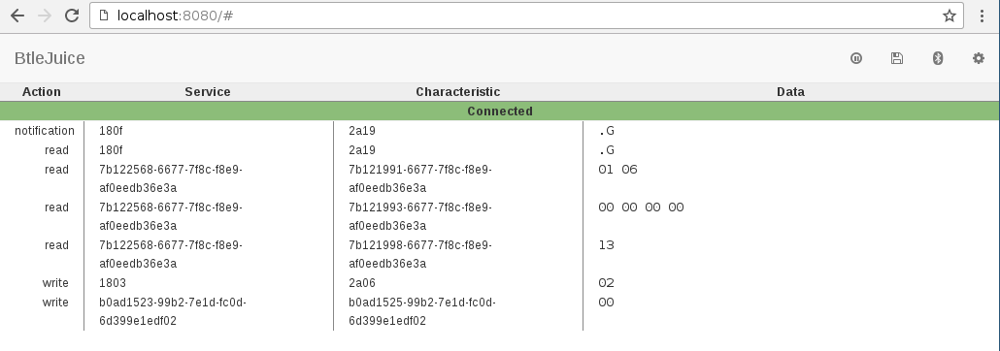
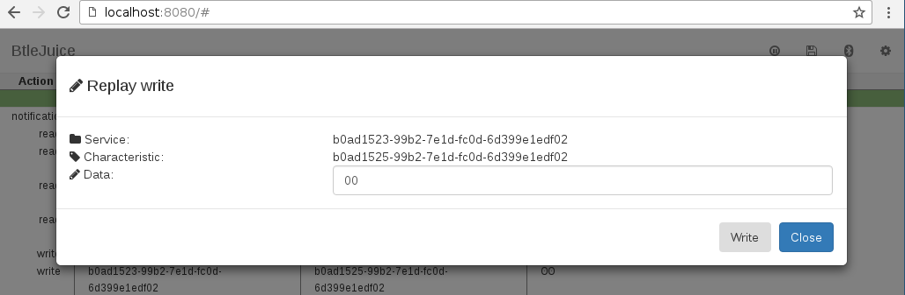
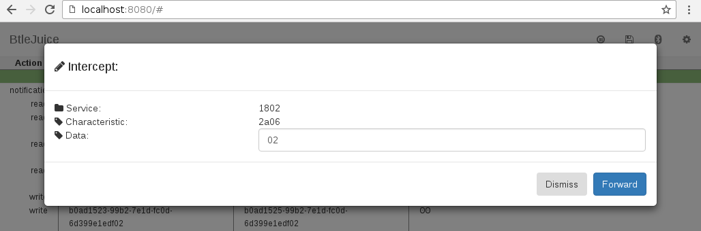
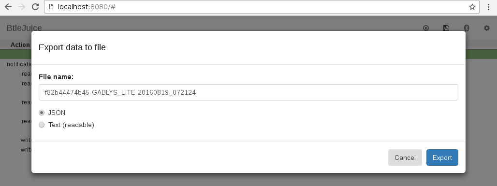
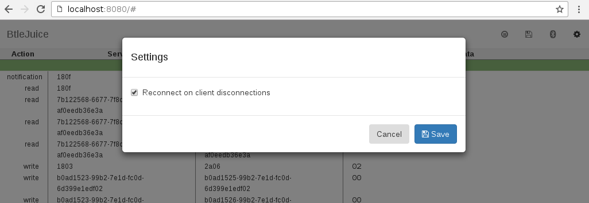

BtleJuice Framework
===================

Introduction
------------

BtleJuice is a complete framework to perform Man-in-the-Middle attacks on
Bluetooth Smart devices (also known as Bluetooth Low Energy). It is composed of:

* an interception core
* an interception proxy
* a dedicated web interface
* Python and Node.js bindings

How to install BtleJuice ?
--------------------------

Installing BtleJuice is a child's play. First of all, make sure your system uses
a recent version of *Node.js* (>=4.3.2) and *npm*. Then, make sure to install all the
required dependencies:

### Ubuntu/Debian/Raspbian

```
sudo apt-get install bluetooth bluez libbluetooth-dev libudev-dev
```

### Fedora / Other-RPM based

```
sudo yum install bluez bluez-libs bluez-libs-devel npm
```

Last, install BtleJuice using *npm*:

```
sudo npm install -g btlejuice
```

If everything went well, BtleJuice is ready to use !


How to use BtleJuice ?
----------------------

BtleJuice is composed of two main components: an interception proxy and a core.
These two components are required to run on independent machines in order to
operate simultaneously two bluetooth 4.0+ adapters. **BtleJuice Proxy does not work
in a Docker container**.

The use of a virtual machine may help to make this framework work on a single computer.

From your virtual machine, install *btlejuice* and make sure your USB BT4 adapter is available from the virtual machine:

```
$ sudo hciconfig
hci0:	Type: BR/EDR  Bus: USB
	BD Address: 10:02:B5:18:07:AD  ACL MTU: 1021:5  SCO MTU: 96:6
	DOWN
	RX bytes:1433 acl:0 sco:0 events:171 errors:0
	TX bytes:30206 acl:0 sco:0 commands:170 errors:0
$ sudo hciconfig hci0 up
```

Then, make sure your virtual machine has an IP address reachable from the host.

Launch the proxy in your virtual machine:

```
$ sudo btlejuice-proxy
```

On your host machine, don't forget to stop the bluetooth service and ensure the HCI device remains opened/initialized:
```
$ sudo service bluetooth stop
$ sudo hciconfig hci0 up
```

Finally, run the following command on your host machine:

```
$ sudo btlejuice -u <Proxy IP address> -w
```

The *-w* flag tells BtleJuice to start the web interface while the *-u* option specifies the proxy's IP address.

The Web User Interface is now available at http://localhost:8080. Note the web server port may be changed through command-line.

Using the web interface
-----------------------

The BtleJuice's web interface provides in the top-right corner a set of links to control the interception core, as shown below.



### Target selection

First, click the *Select target* button and a dialog will show up displaying all the available Bluetooth Low Energy devices detected by the interception core:



Double-click on the desired target, and wait for the interface to be ready (the bluetooth button's aspect will change). Once the dummy device ready, use the associated mobile application or another device (depending on what is expected) to connect to the dummy device. If the connection succeeds, a *Connected* event would be shown on the main interface.



All the intercepted GATT operations are then displayed with the corresponding services and characteristics UUID, and of course the data associated with them. The data is shown by default with the HexII format (a variant of the format designed by Ange Albertini), but you may want to switch from HexII to Hex (and back) by clicking on the data itself. Both Hex and HexII format are supported by BtleJuice.

### Replay GATT operations

It is possible to replay any GATT operation by right-clicking it and then selecting the *Replay* option, as shown below:




Click the *Write* (or *Read*) button to replay the corresponding GATT operation. This operation will be logged in the main interface.

### On-the-fly data modification

Last but not least, the interface may intercept locally or globally any GATT operation and allow on-the-fly data modification. You may either use the global interception by clicking the *Intercept* button in the top-right corner or use the contextual menu to enable or disable a hook on a given service and characteristic. Any time a GATT operation is intercepter, the following dialog box will show up:



### Export data to file

Since version 1.0.6, the interface provides a data export feature allowing readable and JSON exports. These exports are generated based on the intercepted GATT operations, but also include information about the target device. When the *Export* button is clicked, the following dialog will show up:



Click the *Export* button at the bottom of the dialog box to download a JSON (or text) version of the intercepted data.

### Settings

The settings dialog provides a single option at the moment allowing to automatically reconnect the proxy when the target device disconnects. This may be useful when dealing with devices that are active during a short amount of time.



### Disconnection

Clicking the top-right *Select Target* button when the proxy is active will stop it and allow target selection again.

Installing the bindings
-----------------------

BtleJuice's Node.js bindings may be installed as well through *npm*:

```
$ sudo npm install -g btlejuice-bindings
```

More information about how to use the Node.js bindings in the [package documentation](https://www.npmjs.com/package/btlejuice-bindings).


Thanks
------

A special thank to Slawomir Jasek who pointed out many noble/bleno tricks to avoid issues with mobile applications, and shared BLE MITM strategies during DEF CON 24 =). He is also the author of [Gattacker](https://github.com/securing/gattacker).


License
-------

Copyright (c) 2016 Econocom Digital Security

Permission is hereby granted, free of charge, to any person obtaining a copy of this software and associated documentation files (the "Software"), to deal in the Software without restriction, including without limitation the rights to use, copy, modify, merge, publish, distribute, sublicense, and/or sell copies of the Software, and to permit persons to whom the Software is furnished to do so, subject to the following conditions:

The above copyright notice and this permission notice shall be included in all copies or substantial portions of the Software.

THE SOFTWARE IS PROVIDED "AS IS", WITHOUT WARRANTY OF ANY KIND, EXPRESS OR IMPLIED, INCLUDING BUT NOT LIMITED TO THE WARRANTIES OF MERCHANTABILITY, FITNESS FOR A PARTICULAR PURPOSE AND NONINFRINGEMENT. IN NO EVENT SHALL THE AUTHORS OR COPYRIGHT HOLDERS BE LIABLE FOR ANY CLAIM, DAMAGES OR OTHER LIABILITY, WHETHER IN AN ACTION OF CONTRACT, TORT OR OTHERWISE, ARISING FROM, OUT OF OR IN CONNECTION WITH THE SOFTWARE OR THE USE OR OTHER DEALINGS IN THE SOFTWARE.
